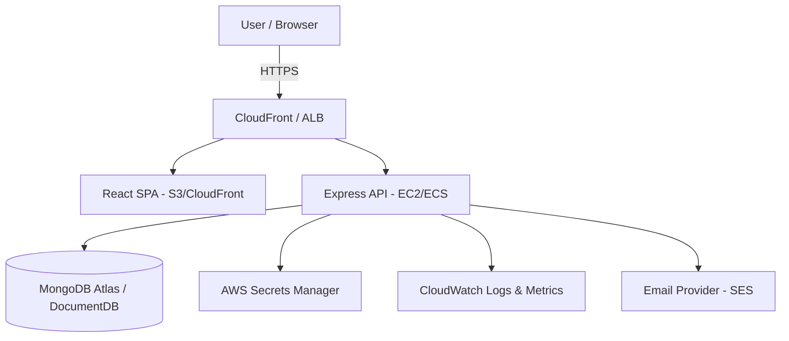
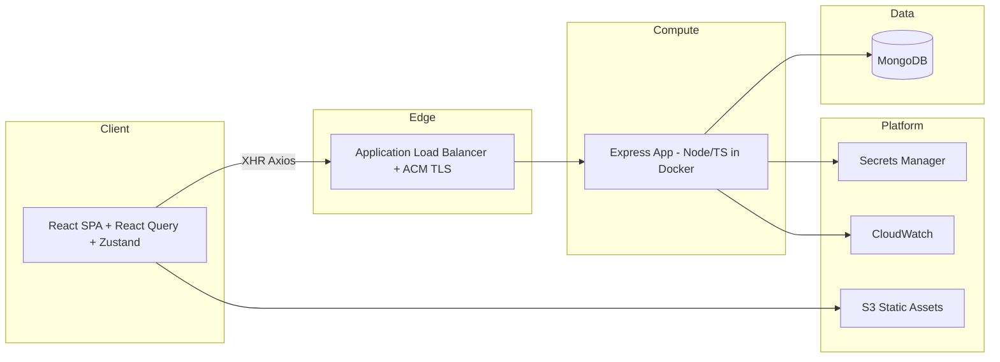

# Project Architecture Document — Todo Application

> **Status:** Draft v1.0 · **Owner:** Principal Architect · **Last updated:** 2026-06-02
> **Audience:** Engineering, DevOps, Security, QA, Product.
> This is the single source of truth for _why_ the system is built the way it is. Code decisions that contradict this document require an [ADR](./adr/) and a review.

---

## 0. Document Map

| Section                        | Question it answers                |
| ------------------------------ | ---------------------------------- |
| 1. Business Requirements       | Why does this project exist?       |
| 2. Functional Requirements     | What must it do?                   |
| 3. Non-Functional Requirements | How well must it do it?            |
| 4. Architecture Overview       | What are the moving parts?         |
| 5. Architecture Decisions      | What did we choose and why?        |
| 6. Tradeoffs                   | What did we give up?               |
| 7. Scalability Strategy        | How does it grow?                  |
| 8. Security Strategy           | How is it protected?               |
| 9. Database Strategy           | How is data modeled and stored?    |
| 10. AWS Strategy               | Where does it run?                 |
| 11. Monitoring Strategy        | How do we see it?                  |
| 12. Logging Strategy           | How do we trace it?                |
| 13. Deployment Strategy        | How does it ship?                  |
| 14. Disaster Recovery          | How do we survive failure?         |
| 15. Cost Estimation            | What does it cost?                 |
| 16. Design Patterns Analysis   | Which patterns, and justified how? |

---

## 1. Business Requirements

### 1.1 Purpose

This is primarily a **learning vehicle** to practice production-grade engineering end-to-end: React architecture, Node.js architecture, security, AWS, Docker, CI/CD, observability, design patterns, and enterprise documentation. The Todo domain is intentionally simple so that **complexity lives in the engineering, not the business logic**.

### 1.2 Business Goals

| ID   | Goal                                          | Success Metric                                                                           |
| ---- | --------------------------------------------- | ---------------------------------------------------------------------------------------- |
| BG-1 | Demonstrate a secure, multi-user task manager | Users can register, log in, and manage private todos with zero cross-tenant data leakage |
| BG-2 | Be operable by one engineer                   | Deploy, monitor, and recover without a team                                              |
| BG-3 | Be cost-efficient                             | Runnable for < $20/mo in the cheapest configuration                                      |
| BG-4 | Be a reference architecture                   | Every decision documented and defensible                                                 |

### 1.3 Stakeholders

- **Owner/Operator** — the learner; wears all hats.
- **End users** — individuals managing personal/team todos.
- **Future contributors** — onboarded purely through documentation.

### 1.4 Constraints

- Single-region to start (cost).
- Modular monolith, not microservices (premature distribution is a learning anti-goal).
- Managed services preferred over self-hosted where cost allows.

---

## 2. Functional Requirements

### 2.1 Authentication & Accounts

- FR-A1: User registration with email + password.
- FR-A2: Login issuing a short-lived **access token** (JWT) and a long-lived **refresh token**.
- FR-A3: Refresh-token rotation with reuse detection.
- FR-A4: Logout (single session) and logout-all (revoke all refresh tokens).
- FR-A5: Password reset via email token (Phase 2+).

### 2.2 RBAC

- FR-R1: Roles: `user`, `admin`.
- FR-R2: `user` can CRUD only their own todos.
- FR-R3: `admin` can list users, disable accounts, and read audit logs.
- FR-R4: Role checks enforced server-side on every protected route; the frontend only _hints_ UI.

### 2.3 Todos

- FR-T1: Create todo (`title`, optional `description`, `dueDate`, `priority`, `tags`).
- FR-T2: List own todos with filtering (status, priority, tag), sorting, and pagination.
- FR-T3: Update todo fields and toggle `completed`.
- FR-T4: Soft-delete and restore; hard-delete after retention window.
- FR-T5: Full-text search on title/description.

### 2.4 Cross-cutting

- FR-X1: Every mutating request is validated (Zod) before reaching business logic.
- FR-X2: Every request carries/receives a correlation ID.
- FR-X3: Audit log for security-relevant events (login, role change, account disable).

### 2.5 Out of Scope (v1)

Real-time collaboration, file attachments, notifications/push, mobile native apps, billing.

---

## 3. Non-Functional Requirements

| Category        | Requirement                   | Target                             |
| --------------- | ----------------------------- | ---------------------------------- |
| Performance     | p95 API latency (read)        | < 200 ms server-side               |
| Performance     | p95 API latency (write)       | < 400 ms server-side               |
| Availability    | Production uptime             | 99.5% (cheap), 99.9% (prod-HA)     |
| Scalability     | Concurrent users              | 1k cheap → 50k horizontally        |
| Security        | OWASP Top 10 coverage         | All mitigated, documented          |
| Security        | Secrets at rest               | Never in repo; AWS Secrets Manager |
| Observability   | Mean time to detect (MTTD)    | < 5 min via alarms                 |
| Maintainability | Test coverage                 | ≥ 80% lines, critical paths 100%   |
| Maintainability | Type safety                   | `strict` TS, zero `any`            |
| Portability     | Run locally identical to prod | Docker Compose parity              |
| Compliance      | PII handling                  | Email is PII → redacted in logs    |
| Accessibility   | Frontend                      | WCAG 2.1 AA for core flows         |

---

## 4. Architecture Overview

### 4.1 Style

- **Modular Monolith** backend (Clean Architecture layering), **Feature-Based** React frontend.
- Single deployable backend artifact, internally split into feature modules with explicit boundaries — so it can be carved into services later _if_ metrics ever justify it (they likely won't at this scale; that's the point).

### 4.2 C4 — Context (Level 1)



### 4.3 C4 — Container (Level 2)



### 4.4 Backend Internal Layering (Clean Architecture)

```
HTTP (Express routes/controllers)   ← transport, no business logic
        │ depends on
Application (use-cases / services)  ← orchestration, transactions
        │ depends on (interfaces)
Domain (entities, value objects)    ← pure business rules, no I/O
        ↑ implemented by
Infrastructure (Mongoose repos,     ← I/O, DB, external services
  logger, token service, cache)
```

Dependency rule: **inner layers never import outer layers.** Controllers depend on service interfaces; services depend on repository interfaces; infrastructure implements them. This is **Dependency Inversion** in practice and what makes the monolith testable and splittable.

### 4.5 Feature Module Anatomy (backend)

Each feature (`auth`, `todos`, `users`) is a self-contained slice:

```
feature/
  domain/        entities, value-objects, domain errors
  application/   service(s), DTOs, use-case orchestration
  infrastructure/ repository impl, mappers
  interface/     router, controller, request/response schemas (Zod)
  feature.module.ts  wires dependencies (composition root per feature)
  CLAUDE.md
```

---

## 5. Architecture Decisions (summary; full ADRs in `/docs/adr`)

| #   | Decision                                                                   | Rationale                                                                                        | ADR                                                     |
| --- | -------------------------------------------------------------------------- | ------------------------------------------------------------------------------------------------ | ------------------------------------------------------- |
| 1   | **Modular monolith** over microservices                                    | Lower ops cost & cognitive load at this scale; clean boundaries preserve future optionality      | [ADR-0001](./adr/0001-modular-monolith.md)              |
| 2   | **Zustand** over Redux Toolkit                                             | See §5.1                                                                                         | [ADR-0002](./adr/0002-zustand-over-redux.md)            |
| 3   | **JWT access + rotating refresh**                                          | Stateless reads, revocable sessions, theft detection                                             | [ADR-0003](./adr/0003-auth-jwt-refresh-rotation.md)     |
| 4   | **EC2 + Docker** for cheap; **ECS Fargate** as documented future migration | Cheapest viable prod; clean upgrade path                                                         | [ADR-0004](./adr/0004-ec2-docker-cheap-ecs-future.md)   |
| 5   | **React Query** owns server state                                          | Caching, retries, invalidation for free; keeps client state tiny                                 | [ADR-0005](./adr/0005-react-query-server-state.md)      |
| 6   | **MongoDB + Mongoose**                                                     | Document model fits flexible todo schema; familiar; Atlas free tier for cheap env                | [ADR-0006](./adr/0006-mongodb-mongoose.md)              |
| 7   | **Clean Architecture + Repository pattern**                                | Testability, DIP, swap data layer without touching domain                                        | [ADR-0007](./adr/0007-clean-architecture-repository.md) |
| 8   | **Winston** logging                                                        | Mature, flexible structured logging; transports + custom formats; CloudWatch transport available | [ADR-0008](./adr/0008-winston-logging.md)               |

### 5.1 State Management: Zustand vs Redux Toolkit (justification)

**Decision: Zustand.**

| Criterion            | Zustand                                                  | Redux Toolkit                                                    |
| -------------------- | -------------------------------------------------------- | ---------------------------------------------------------------- |
| Boilerplate          | Minimal (a hook + store)                                 | Slices, store config, providers                                  |
| Server cache         | Delegated to React Query                                 | Often misused as server cache (RTK Query exists but overlaps RQ) |
| Learning curve       | Low                                                      | Moderate                                                         |
| DevTools/time-travel | Available via middleware                                 | First-class                                                      |
| Bundle size          | ~1KB                                                     | Larger                                                           |
| Best fit             | Small **client** state (theme, auth-UI, filters, modals) | Large, deeply shared, action-audited state                       |

**Reasoning:** React Query already owns all _server_ state (todos, user). What remains is small **client** UI state. Zustand handles that with the least ceremony, which keeps the learning focus on architecture rather than Redux plumbing. If the app ever grows complex, cross-feature, audited client state, ADR-0002 documents the migration trigger to RTK.

---

## 6. Tradeoffs

| Choice                      | We gain                     | We accept                                                                                    |
| --------------------------- | --------------------------- | -------------------------------------------------------------------------------------------- |
| Monolith                    | Simplicity, cheap ops       | Single deploy unit; must enforce boundaries by discipline                                    |
| MongoDB                     | Schema flexibility          | Weaker multi-document transactional guarantees vs SQL (mitigated: Mongo txns on replica set) |
| JWT access tokens           | Stateless, scalable reads   | Can't instantly revoke access tokens (mitigated: short TTL + refresh revocation)             |
| EC2 single instance (cheap) | Low cost                    | Single point of failure (mitigated by DR plan + fast redeploy)                               |
| Zustand                     | Tiny, fast                  | No built-in time-travel/audit (acceptable for client UI state)                               |
| SPA on S3/CloudFront        | Cheap, fast static delivery | SEO limited (acceptable; app is behind auth)                                                 |

---

## 7. Scalability Strategy

**Vertical first, horizontal when measured.**

1. **Stateless API** — no in-process session state; refresh tokens in DB. Enables N instances behind the ALB.
2. **Horizontal scale** — add API containers; ALB round-robins. Target tracking on CPU/req-count (ECS) or ASG (EC2).
3. **Database** — start single replica set; scale reads via secondary read-preference; shard on `userId` only if a single replica set is ever saturated (unlikely at learning scale; documented for completeness).
4. **Caching** — React Query on client; optional Redis (ElastiCache) for hot reads/rate-limit counters in prod tier. Cache provider is abstracted behind an interface (see §16) so in-memory ↔ Redis is a config swap.
5. **Statics** — S3 + CloudFront scale effectively infinitely.
6. **Backpressure** — rate limiting + request size limits + connection pool caps protect the DB.

**Scaling ladder:** single EC2 → EC2 + ALB + ASG → ECS Fargate + autoscaling → add Redis → DB read replicas → (only if ever needed) shard.

---

## 8. Security Strategy

Full detail in [`docs/security.md`](./security.md). Summary of layers (defense in depth):

- **Edge:** TLS via ACM, HSTS, security headers (Helmet), CORS allowlist, WAF (prod tier).
- **AuthN:** bcrypt/argon2 password hashing, short-lived access JWT (15 min), rotating refresh tokens (7 days) stored hashed in DB with reuse detection.
- **AuthZ:** server-side RBAC middleware on every protected route; ownership checks in the service layer.
- **Input:** Zod validation at the boundary; Mongoose schema as second gate; sanitization against NoSQL injection.
- **Transport/storage of secrets:** AWS Secrets Manager + IAM least privilege; nothing sensitive in env files committed to git.
- **Rate limiting:** per-IP and per-user; stricter on auth endpoints.
- **Logging security:** PII redaction (emails, tokens never logged); audit log for security events.
- **Frontend:** access token in memory (not localStorage), refresh token in `HttpOnly; Secure; SameSite` cookie; CSP; XSS-safe rendering; CSRF defense for cookie-based refresh.

---

## 9. Database Strategy

Full detail in [`docs/database.md`](./database.md). Summary:

- **Engine:** MongoDB (Atlas free/shared tier for local/dev/qa; Atlas dedicated or DocumentDB for staging/prod).
- **Collections:** `users`, `todos`, `refreshTokens`, `auditLogs`.
- **Access:** Repository pattern over Mongoose; no Mongoose models leak past infrastructure layer.
- **Indexes:** compound `{ userId: 1, completed: 1, dueDate: 1 }`, text index on `todos.title/description`, unique `users.email`, TTL index on `refreshTokens.expiresAt`.
- **Integrity:** ownership enforced in queries (`{ _id, userId }`); soft-delete via `deletedAt`.
- **Transactions:** multi-doc operations (e.g., refresh rotation) use sessions on a replica set.

---

## 10. AWS Strategy

Full detail in [`docs/aws.md`](./aws.md). Two reference topologies:

- **Cheapest (~$15–25/mo):** 1× EC2 `t4g.small` running Docker Compose (API + reverse proxy), MongoDB Atlas free/shared, S3+CloudFront for SPA, CloudWatch logs, Route53, ACM. No ALB (use Caddy/Nginx for TLS) or single ALB.
- **Production-grade (~$120–200/mo):** ALB + ACM, EC2 ASG or ECS Fargate (2 tasks), ECR, MongoDB Atlas dedicated, Secrets Manager, CloudWatch dashboards+alarms, S3+CloudFront, Route53, WAF, VPC with public/private subnets, NAT.

---

## 11. Monitoring Strategy

Full detail in [`docs/monitoring.md`](./monitoring.md). Summary:

- **Health:** `/health` (liveness) and `/ready` (readiness: DB ping) endpoints; ALB target health checks.
- **Metrics:** request rate, error rate, p50/p95/p99 latency, event-loop lag, DB connection pool, auth failure rate. Emitted to CloudWatch (EMF or custom metrics).
- **Dashboards:** one CloudWatch dashboard per environment.
- **Alarms:** 5xx rate, latency p95 breach, host CPU/mem, DB connection saturation, auth-failure spike (possible attack) → SNS → email.
- **SLOs:** documented with error budgets.

---

## 12. Logging Strategy

Full detail in [`docs/logging.md`](./logging.md). Summary:

- **Structured JSON** via Winston (`format.json()`). One log line = one JSON object.
- **Correlation ID** per request (incoming `x-request-id` or generated); propagated through async context (AsyncLocalStorage) into every log line and returned to client.
- **Log classes:** request, error, security, audit.
- **Levels:** `trace/debug` (local), `info` (default), `warn`, `error`, `fatal`.
- **PII redaction:** a custom Winston format that redacts `email`, `password`, `authorization`, `token`, `refreshToken` before any transport.
- **Sink:** stdout → Docker → CloudWatch Logs agent; retention policy per environment.

---

## 13. Deployment Strategy

Full detail in [`docs/cicd.md`](./cicd.md) and [`docs/docker.md`](./docker.md). Summary:

- **Pipeline (GitHub Actions):** lint → typecheck → unit → integration → security scan (npm audit, Trivy, CodeQL, gitleaks) → build multi-stage Docker images → push to ECR → deploy.
- **Deploy mechanism:** cheap tier = SSH/SSM pull-and-restart compose; prod tier = ECS rolling/blue-green or ASG instance refresh.
- **Environments:** local → development → qa → staging → production, each with isolated config/secrets.
- **Promotion:** branch-based (see Git Strategy); image immutability — same image promoted across envs, config injected at runtime.
- **Rollback:** redeploy previous immutable image tag; DB migrations are backward-compatible (expand/contract).

### 13.1 Environment Matrix

The single reference for how each environment is wired (consolidates `git-strategy.md`, `aws.md`, `logging.md`, `database.md`).

| Env             | Branch                  | Deploy trigger        | AWS topology                         | DB tier                      | Logs (level / retention) | Secrets                   | Notes                                  |
| --------------- | ----------------------- | --------------------- | ------------------------------------ | ---------------------------- | ------------------------ | ------------------------- | -------------------------------------- |
| **local**       | any (`feature/*`)       | `docker compose up`   | none (Docker)                        | local Mongo (RS=1) + Mailhog | `debug` / ephemeral      | `.env` (gitignored)       | hot reload; in-memory cache/rate-limit |
| **development** | `develop`               | auto on merge         | cheap (EC2+compose)                  | Atlas M0/M2 (shared)         | `debug` / 7d             | Secrets Manager (dev)     | smoke test post-deploy                 |
| **qa**          | `qa`                    | promote               | cheap (EC2+compose)                  | Atlas M2 (shared)            | `info` / 14d             | Secrets Manager (qa)      | full integration suite                 |
| **staging**     | `staging` / `release/*` | promote + approval    | prod-HA (ALB+ECS/ASG)                | Atlas M10 (dedicated)        | `info` / 14d             | Secrets Manager (staging) | full E2E + load; mirrors prod          |
| **production**  | `main`                  | tag + manual approval | prod-HA (ALB+ECS/ASG, WAF, multi-AZ) | Atlas M10+ (dedicated, PITR) | `info` / 30–90d          | Secrets Manager (prod)    | blue-green; alarms→SNS                 |

- **Same image (git-SHA tag)** flows local→prod; only config/secrets differ.
- Redis (cache + rate-limit) is in-memory locally, ElastiCache/Atlas-adjacent from staging up.
- `SameSite=Strict` refresh cookie + `app.<domain>`/`api.<domain>` same-registrable-domain layout applies in deployed envs (see `security.md` §8.2).

---

## 14. Disaster Recovery Strategy

| Concern                       | Plan                                                                          |
| ----------------------------- | ----------------------------------------------------------------------------- |
| **RPO** (data loss tolerance) | ≤ 24h cheap (daily backup), ≤ 1h prod (continuous/PITR via Atlas)             |
| **RTO** (recovery time)       | ≤ 2h cheap (redeploy + restore), ≤ 30m prod                                   |
| DB backups                    | Atlas automated snapshots; export to S3 (versioned, lifecycle to Glacier)     |
| Infra recreate                | Infrastructure-as-code (Terraform) — rebuild env from scratch reproducibly    |
| Image availability            | Immutable images in ECR; retain last N tags                                   |
| Secrets                       | Secrets Manager replicated; documented rotation runbook                       |
| Runbooks                      | `/docs` runbooks for: DB restore, full region rebuild, rollback, key rotation |
| Game days                     | Quarterly restore drill (documented in runbook)                               |

Failure scenarios covered: instance loss, AZ loss, DB corruption, accidental delete (soft-delete + backups), credential leak (rotation runbook + revocation).

---

## 15. Cost Estimation

### 15.1 Cheapest viable (single region, low traffic)

| Item            | Spec                                | Est. $/mo      |
| --------------- | ----------------------------------- | -------------- |
| EC2             | `t4g.small` (ARM, reserved/savings) | ~$10           |
| MongoDB Atlas   | M0 free / M2 shared                 | $0–9           |
| S3 + CloudFront | low GB + requests                   | ~$1–3          |
| Route53         | 1 hosted zone                       | $0.50          |
| CloudWatch      | basic logs/metrics                  | ~$2            |
| ACM             | TLS certs                           | $0             |
| **Total**       |                                     | **~$15–25/mo** |

### 15.2 Production-grade (HA)

| Item                      | Spec                                           | Est. $/mo                  |
| ------------------------- | ---------------------------------------------- | -------------------------- |
| ALB                       | 1 ALB                                          | ~$18 + LCU                 |
| Compute                   | ECS Fargate 2× 0.5vCPU/1GB or 2× EC2 t4g.small | ~$30–40                    |
| MongoDB Atlas             | M10 dedicated                                  | ~$57                       |
| NAT Gateway               | 1 (or NAT instance to save)                    | ~$32 (or ~$4 NAT instance) |
| Secrets Manager           | few secrets                                    | ~$2                        |
| CloudWatch                | dashboards+alarms+logs                         | ~$10                       |
| S3+CloudFront+Route53+WAF |                                                | ~$10–20                    |
| **Total**                 |                                                | **~$120–200/mo**           |

**Cost levers:** ARM (Graviton) instances, savings plans, NAT instance over NAT gateway, single-AZ for non-prod, log retention limits, Atlas shared tier for non-prod, scale-to-zero non-prod environments on a schedule.

---

## 16. Design Patterns Analysis (mandatory)

> Rule: **patterns only where they remove real pain.** Each below is justified or explicitly rejected.

### 16.1 Singleton

| Candidate               | Use Singleton?            | Reasoning                                                                                                                                                                                                                                           |
| ----------------------- | ------------------------- | --------------------------------------------------------------------------------------------------------------------------------------------------------------------------------------------------------------------------------------------------- |
| **Logger**              | ✅ Yes (module singleton) | One configured logger instance shared app-wide; child loggers per request carry correlation IDs. Implemented as a module-level export, not a class with `getInstance()` — simpler, test-friendly via DI override.                                   |
| **Database connection** | ✅ Yes                    | A single Mongoose connection pool must be reused; multiple connections waste resources and exhaust limits. Guard against re-connect; expose a `connect()/disconnect()` lifecycle. Avoid hidden global state — inject the connection where possible. |
| **Cache provider**      | ✅ Yes (single client)    | One Redis client/pool per process. Behind a `CacheProvider` interface so it can be a no-op/in-memory locally.                                                                                                                                       |
| Config                  | ✅ Yes                    | Parse + validate env once (Zod), freeze, export.                                                                                                                                                                                                    |

**Singleton risks documented:** hidden global state, hard-to-test, hidden dependencies, lifecycle/ordering bugs. **Mitigation:** prefer _module singletons created at the composition root and injected_, not classic `getInstance()` global access. This keeps DIP and testability intact.

### 16.2 Factory

| Candidate                | Use Factory?              | Reasoning                                                                                                                                                                                |
| ------------------------ | ------------------------- | ---------------------------------------------------------------------------------------------------------------------------------------------------------------------------------------- |
| **Repository creation**  | ✅ Yes                    | A repository factory binds a Mongoose model + logger into a repository instance. Centralizes construction, enables swapping implementations (Mongo ↔ in-memory for tests).               |
| **Service registration** | ✅ Yes (composition root) | Each feature module exposes a `createXModule(deps)` factory that wires repositories → services → controllers. This is the **composition root** and the backbone of Dependency Inversion. |
| **Cache provider**       | ✅ Yes                    | `createCacheProvider(config)` returns Redis or in-memory implementation based on env.                                                                                                    |
| Token service            | ✅ Yes                    | Factory builds it with signing keys from config; enables a fake in tests.                                                                                                                |

**Factory risks documented:** over-abstraction, indirection that hurts readability. **Mitigation:** factories live only at module boundaries / composition roots, never sprinkled per-call.

### 16.3 Other patterns used (briefly)

- **Repository** — abstracts persistence; domain/services depend on interfaces.
- **Strategy** — pluggable cache (in-memory/Redis), pluggable mailer (console/SES).
- **Middleware (Chain of Responsibility)** — Express cross-cutting concerns (auth, validation, rate-limit, error handler).
- **DTO / Mapper** — translate between persistence models and domain/transport, preventing leaky abstractions.
- **Adapter** — wrap external SDKs (SES, Secrets Manager) behind interfaces.

### 16.4 Patterns explicitly rejected

- **Abstract Factory / Builder** for entities — overkill for simple todos.
- **Event Sourcing / CQRS** — no audit/throughput need that justifies the complexity.
- **Microservice-per-feature** — premature distribution; modular monolith suffices.

---

## 17. Open Questions / Decisions Deferred

- Email provider: SES vs third-party (deferred to Phase 2; abstracted behind `Mailer`).
- Atlas vs DocumentDB for prod (cost vs VPC-native; ADR when prod env is provisioned).
- Redis introduction trigger (documented metric threshold in §7).

---

_End of Architecture Document. Changes require an ADR + Architecture Review (see `/docs/cicd.md` review gates)._
