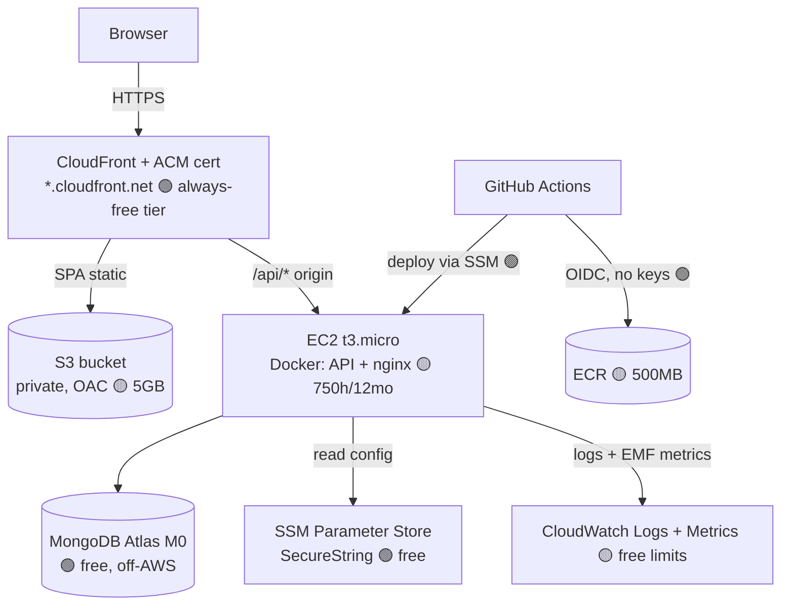

# AWS Free-Tier Learning Plan (target: ₹0)

> **Goal:** deploy this project to AWS to learn IAM, VPC, EC2, S3, ECR, CloudWatch,
> SSL/TLS, CI/CD, Security Groups, and monitoring/logging — while keeping the bill
> at or near **₹0** and avoiding surprise charges.
>
> **Operating rule for this plan:** nothing billable is created without your
> explicit approval. Every step below is marked **🟢 free**, **🟡 free-with-limits**,
> or **🔴 needs approval**. When we actually deploy, I will **stop and warn you
> before any 🟡/🔴 resource.**

---

## 0. The single most important fact (read first)

Since **1 Feb 2024, AWS charges ~$0.005/hour (~₹0.42/hr ≈ ₹305/month) for _every_
public IPv4 address — even one that is attached and in use.**

- The **12-month Free Tier now includes 750 hrs/month of in-use public IPv4**, which
  exactly covers **one** always-on instance. So: **₹0 for 12 months with one public
  IP**, then ~₹305/mo per IP after that (or immediately if you run a 2nd).
- ➡️ Plan: **one** EC2 with **one** public IP, and a **calendar reminder to tear
  down (or stop & release the IP) well before month 12.** An **idle Elastic IP**
  (allocated but not attached to a running instance) is billed immediately — so we
  use the instance's auto-assigned public IP, **not** a separate Elastic IP.

This one rule is why the architecture below avoids NAT Gateways, load balancers,
and extra IPs entirely.

---

## 1. Guardrails — set these up FIRST (all 🟢 free), before any other resource

1. **AWS Budgets**: create a **$1/month** budget with alerts at 50% / 80% / 100%
   to your email. (First 2 budgets are free.)
2. **Free Tier usage alerts**: Billing console → enable "Receive Free Tier Usage
   Alerts".
3. **Billing alarm via CloudWatch** (`EstimatedCharges` > $1) → SNS → email.
4. **One region only** (e.g. `ap-south-1` Mumbai) — keeps everything together and
   avoids accidental cross-region/duplicate resources. Pick once, never switch.
5. **Cost Explorer**: enable (free) so you can see daily spend the next morning.
6. **IAM**: operate as an **IAM user/role with MFA**, not the root account. Root only
   for billing setup.

> Why first? If anything ever does start to bill, you find out within hours for
> cents — not at month-end for thousands.

---

## 2. Recommended ₹0 architecture

A trimmed version of the project's "cheapest tier" (docs/aws.md §2), adjusted so
**every component is Free-Tier-eligible**:

**Key free-tier substitutions vs the repo's current Terraform (Phase 8):**

| Repo (Phase 8) uses                   | Free-tier plan uses instead                                                      | Why                                                                                 |
| ------------------------------------- | -------------------------------------------------------------------------------- | ----------------------------------------------------------------------------------- |
| EC2 **t4g.small** (ARM)               | **t3.micro** (or t2.micro)                                                       | t3/t2.micro = 750 free hrs/12mo; the ARM t4g free trial has ended                   |
| **Secrets Manager** ($0.40/secret/mo) | **SSM Parameter Store** SecureString                                             | Parameter Store standard params are **free**; KMS via `aws/ssm` managed key is free |
| **Route53** hosted zone ($0.50/mo)    | **No custom domain** → use `*.cloudfront.net` (and optionally **DuckDNS**, free) | Avoids the paid hosted zone                                                         |
| **Elastic IP**                        | Instance **auto-assigned public IP**                                             | Idle EIPs bill; auto IP is covered by the 12-mo public-IPv4 free allowance          |
| ALB + ACM (Phase 10)                  | **CloudFront + ACM** (free tier) for HTTPS                                       | No ALB hourly charge; CloudFront free tier is generous + perpetual                  |
| NAT Gateway (Phase 10)                | **None** (single public subnet)                                                  | NAT is ~₹3,000/mo — never in free tier                                              |

> These are **plan-level** recommendations. The committed Terraform still uses the
> production-grade choices. If you want, I can add a **`free-tier` Terraform variant
> / tfvars** (t3.micro + Parameter Store + no EIP + CloudFront-only) — say the word
> and I'll author + `validate` it (still no apply).

---

## 3. What you learn from each service (and its free-tier limit)

| Service                    | What you'll learn                                                                                              | Free-tier limit                                | 🔴 What triggers charges                                           |
| -------------------------- | -------------------------------------------------------------------------------------------------------------- | ---------------------------------------------- | ------------------------------------------------------------------ |
| **IAM**                    | Users vs roles, least-privilege policies, **OIDC federation** for CI (no static keys), MFA, instance profiles  | Always free                                    | — (IAM itself never bills)                                         |
| **VPC**                    | CIDR, subnets, route tables, Internet Gateway, public vs private                                               | VPC/subnets/IGW/route tables free              | 🔴 **NAT Gateway**, VPC endpoints, traffic mirroring               |
| **EC2**                    | Launch, AMIs, user-data bootstrap, instance profiles, **SSM Session Manager** (no SSH)                         | 750 hrs/mo **t3.micro/t2.micro**, 12 mo        | 🔴 bigger types, 2nd instance, >750h, after 12 mo                  |
| **EBS** (with EC2)         | Block storage, volume types, snapshots                                                                         | 30 GB gp3 + 1 GB snapshots, 12 mo              | 🔴 >30 GB, extra snapshots                                         |
| **Public IPv4**            | Why IPv4 is now metered; IP lifecycle                                                                          | 750 hrs/mo in-use, 12 mo (one IP)              | 🔴 idle EIP, 2nd IP, after 12 mo (~₹305/mo)                        |
| **S3**                     | Buckets, objects, versioning, **static hosting**, bucket policies, SSE                                         | 5 GB, 20k GET, 2k PUT, 12 mo                   | 🔴 >5 GB, heavy requests, cross-region replication                 |
| **CloudFront**             | CDN, **HTTPS/TLS termination**, **ACM certs (free)**, OAC to S3, cache behaviours                              | **1 TB out + 10M requests/mo — perpetual**     | 🔴 >1 TB egress (unlikely for learning)                            |
| **ACM**                    | Public TLS certs, validation                                                                                   | Public certs **free**                          | — (free with CloudFront)                                           |
| **ECR**                    | Private registry, image push/pull, **lifecycle policies**, scan-on-push                                        | 500 MB/mo, 12 mo                               | 🔴 >500 MB (keep last 1–2 images)                                  |
| **CloudWatch**             | Custom **metrics (EMF)**, **log groups**, **alarms**, **dashboards**, log retention                            | 10 metrics, 10 alarms, 5 GB logs, 3 dashboards | 🔴 >10 custom metrics, **detailed (1-min) monitoring**, >5 GB logs |
| **SSM Parameter Store**    | Config/secret storage, SecureString, hierarchy                                                                 | Standard params + standard throughput **free** | 🔴 **Advanced** parameters, higher throughput                      |
| **SSL/TLS**                | Cert issuance/validation, HTTPS end-to-end (CloudFront+ACM; optionally Caddy + Let's Encrypt + DuckDNS on EC2) | Free (ACM / Let's Encrypt)                     | —                                                                  |
| **CI/CD** (GitHub Actions) | OIDC→AWS, ECR push, SSM-driven deploy, gated environments                                                      | GitHub free minutes; AWS side free             | 🔴 only if it creates billable AWS resources                       |
| **Security Groups**        | Stateful firewall, least-access rules, SG-to-SG refs                                                           | Free                                           | —                                                                  |
| **MongoDB Atlas M0**       | Managed Mongo, network allowlist, connection strings                                                           | 512 MB **free forever** (off-AWS)              | 🔴 upgrading tier                                                  |

**Things you will deliberately NOT use** (all commonly cause bills): NAT Gateway,
ALB/NLB, ECS Fargate, Secrets Manager, Route53 hosted zones, DocumentDB,
ElastiCache, customer-managed KMS keys, detailed EC2 monitoring.

---

## 4. Cost-Risk Report (pre-deployment)

| #   | Resource                                              | Risk                         | Likelihood           | Mitigation                                                                   | Gate |
| --- | ----------------------------------------------------- | ---------------------------- | -------------------- | ---------------------------------------------------------------------------- | ---- |
| R1  | Public IPv4 after 12 months                           | ~₹305/mo per IP              | **High eventually**  | Calendar reminder at month 10–11; tear down or move to IPv6-only             | 🟡   |
| R2  | Idle Elastic IP                                       | billed immediately           | Medium               | **Don't allocate an EIP**; use auto-assigned IP                              | 🟡   |
| R3  | Forgetting to stop/terminate EC2                      | exhausts 750h, then bills    | Medium               | Budget alert + cleanup checklist + stop when not learning                    | 🟡   |
| R4  | EBS volume/snapshots left behind                      | small monthly                | Medium               | Cleanup checklist deletes volumes + snapshots                                | 🟡   |
| R5  | S3 / ECR over free size                               | small                        | Low                  | ECR lifecycle (keep 1–2); don't store large objects                          | 🟡   |
| R6  | CloudWatch >10 custom metrics or detailed monitoring  | per-metric                   | Low                  | Keep ≤10 EMF metrics (we have 5); **basic** monitoring only                  | 🟡   |
| R7  | Accidentally creating NAT/ALB/Fargate/Secrets Manager | **large** (₹1,500–3,000+/mo) | Low (if disciplined) | These are excluded from the plan; **🔴 hard-stop approval** if ever proposed | 🔴   |
| R8  | Cross-region duplicates                               | doubles everything           | Low                  | One region only                                                              | 🟡   |
| R9  | Data transfer out > 100 GB/mo                         | per-GB                       | Very low             | Learning traffic is tiny; CloudFront covers SPA                              | 🟢   |
| R10 | Leaving it all running for months                     | compounding                  | Medium               | **Cleanup checklist (§6) the day you finish**                                | 🟡   |

**Net expectation:** **₹0 for the first 12 months** if you (a) run one t3.micro with
its auto IP, (b) avoid the 🔴 services, and (c) clean up or set the month-11
reminder. The realistic "surprise bill" sources are R1, R3, and R7 — all gated.

---

## 5. Deployment approval gates (how I'll "warn before charging")

When we deploy, I will proceed only with your explicit OK at each gate:

1. **Gate A — Guardrails (🟢):** budgets, billing alarm, IAM/MFA, region. _No cost._
2. **Gate B — Free networking + storage (🟢/🟡):** VPC, subnet, IGW, SG, S3 bucket,
   ECR repo, SSM params, IAM/OIDC role. _Free within limits — I'll confirm sizes._
3. **Gate C — EC2 (🟡, first billable-risk point):** I will **stop and tell you**:
   "this launches a t3.micro + one public IPv4 — ₹0 under Free Tier for 12 months,
   ~₹305/mo afterward. Approve?" Only on your yes.
4. **Gate D — CloudFront + ACM (🟡):** free tier, but I'll confirm before creating.
5. **Anything 🔴** (NAT/ALB/Fargate/Secrets Manager/Route53/KMS CMK): I will **refuse
   to create it without an explicit, separate approval** and will first propose the
   free alternative.

---

## 6. Cleanup checklist (run the day you finish — order matters)

> Tear down in roughly reverse-dependency order. Tick every box; then confirm
> **$0** in Cost Explorer the next day.

- [ ] **CI/CD:** set `AWS_DEPLOY_ENABLED=false`; stop any scheduled workflows.
- [ ] **CloudFront:** disable distribution → wait for "Deployed" → delete. Delete the **ACM cert** (us-east-1 for CloudFront).
- [ ] **EC2:** terminate the instance (this frees the auto public IP).
- [ ] **Elastic IP:** if you allocated one, **release** it (else it bills).
- [ ] **EBS:** delete leftover volumes + **snapshots** + deregister private AMIs.
- [ ] **S3:** empty then delete the SPA bucket (and the Terraform **state** bucket if you made one).
- [ ] **ECR:** delete images, then the repos.
- [ ] **CloudWatch:** delete log groups, **alarms**, dashboards, and the billing alarm (keep budgets if you like).
- [ ] **SSM:** delete Parameter Store parameters.
- [ ] **IAM:** delete the GitHub OIDC role/policies; delete the **OIDC provider** if unused elsewhere; remove the EC2 instance profile/role.
- [ ] **VPC:** delete SGs, subnet, route tables, Internet Gateway, then the VPC (delete the VPC last).
- [ ] **DynamoDB:** delete the Terraform **state-lock** table if you created one.
- [ ] **MongoDB Atlas:** terminate the M0 cluster (or keep — it's free forever).
- [ ] **Terraform:** `terraform destroy` handles most AWS items above — run it first, then use this list to catch anything created by hand or left behind (CloudFront/ACM/state bucket often linger).
- [ ] **Verify:** Cost Explorer shows ₹0 the next day; Billing → no active resources; **delete budget/alarm last**.

> Tip: `terraform destroy` from `environments/dev` removes everything Terraform
> created. The manual checklist covers click-ops extras and the state backend.

---

## 7. Suggested hands-on learning order (each step = one concept, ₹0)

1. **Guardrails** (§1) — budgets/alerts/IAM/MFA. _(Billing, IAM)_
2. **S3 + CloudFront + ACM** — host the SPA over HTTPS. _(S3, CDN, TLS)_
3. **VPC + Security Group** — one public subnet, SG rules. _(VPC, SG)_
4. **ECR** — push the backend image; add a lifecycle policy. _(ECR)_
5. **SSM Parameter Store** — store `JWT_ACCESS_SECRET` + `MONGODB_URI`. _(secrets, IAM)_
6. **EC2 t3.micro** — Docker, user-data, instance profile, **SSM Session Manager** (no SSH). _(EC2, IAM, SG)_ — **Gate C**
7. **TLS to the API** — front EC2 with CloudFront (ACM) **or** Caddy + DuckDNS + Let's Encrypt on the box. _(SSL/TLS)_
8. **CloudWatch** — agent ships Docker logs; EMF metrics appear; build 1 dashboard + alarms. _(monitoring, logging)_
9. **CI/CD** — GitHub Actions OIDC → ECR push → SSM deploy → smoke test. _(CI/CD, IAM/OIDC)_
10. **Tear down** (§6) — practice clean, complete deletion. _(cost hygiene)_

---

## 8. Bottom line

- **Expected cost: ₹0** for 12 months if you follow §1 guardrails, use the §2
  architecture, respect the §5 gates, and run §6 cleanup.
- **The three real risks** are the metered public IPv4 after 12 months (R1),
  forgetting to tear down (R3/R10), and accidentally creating a 🔴 service (R7) —
  all explicitly gated.
- I will **not create any 🟡/🔴 AWS resource without warning you first**, and I'll
  refuse 🔴 services unless you separately approve them after seeing the free
  alternative.
