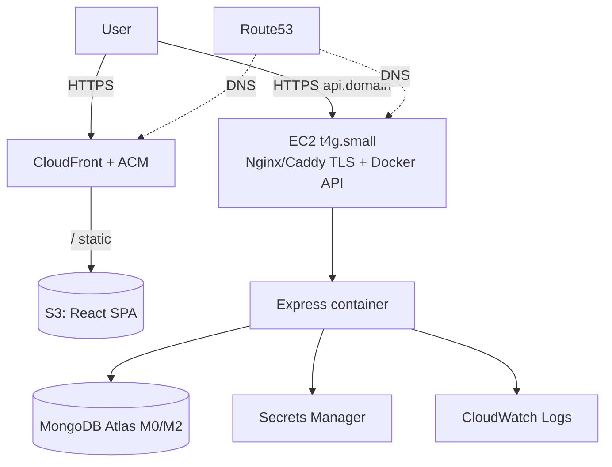
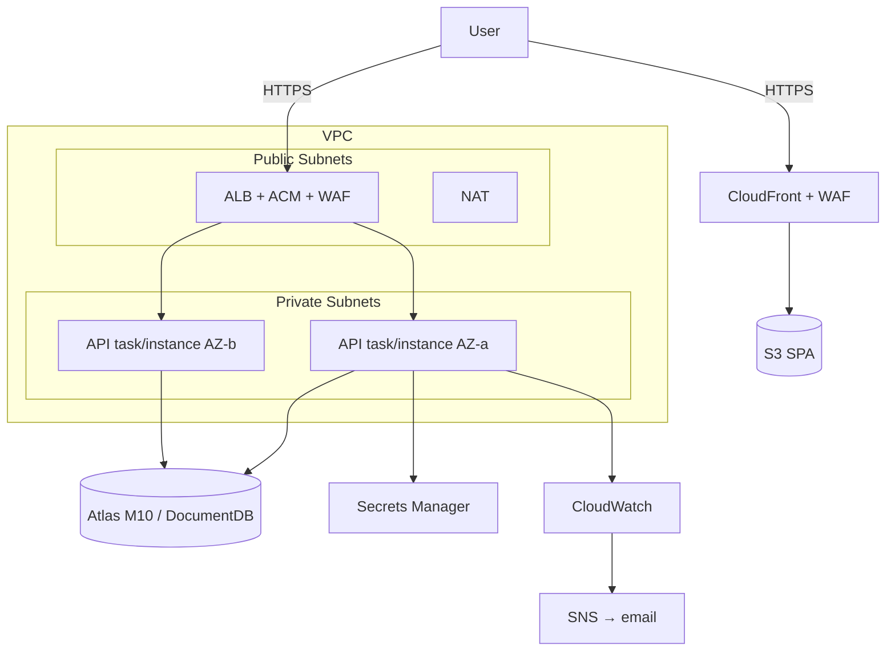

# AWS Architecture

> **Status:** Both tiers authored + validated (Phases 8 & 10) · **Owner:** Cloud Architect · Two reference topologies: **Cheapest** and **Production-grade**.
> Provisioned via Terraform (`infrastructure/terraform`). IAM least-privilege; secrets in Secrets Manager.

## Phase 8 — Terraform (cheapest tier)

Authored and **`terraform validate`-clean** (against the AWS provider schema); not yet applied (apply is a billable decision — see `infrastructure/terraform/README.md`). Modules: `network` (VPC/subnet/SG), `compute` (Graviton EC2 + instance profile + Docker user_data, SSM-only admin), `ecr`, `storage` (S3 private + CloudFront OAC, SPA fallback), `secrets` (Secrets Manager; JWT generated, MONGODB_URI seeded), `github-oidc` (OIDC provider + least-privilege CI deploy role wiring Phase 7's gated workflows). Composed in `environments/dev`. Provision/deploy steps: `infrastructure/aws/runbooks/deploy.md`.

## Phase 10 — Terraform (production-HA tier)

Authored and **`terraform validate`-clean** (not applied). Topology B (ADR-0009): `network-ha` (2-AZ public/private subnets + NAT), `alb` (ALB + ACM DNS-validated TLS + HTTP→HTTPS + Route53 alias), `ecs` (Fargate cluster + service, 2 tasks, CPU target-tracking autoscaling, Secrets Manager injection, rolling deploy with circuit-breaker auto-rollback, Container Insights), `waf` (AWS managed rule groups + per-IP rate limiting on the ALB). Reuses `ecr`/`secrets`/`storage`/`observability`/`github-oidc`. Composed in `environments/prod`. Estimated ~$120–200/mo (§8).

---

## 1. Services Used

| Service                 | Role                                                |
| ----------------------- | --------------------------------------------------- |
| **EC2**                 | Runs Docker (API) — cheapest compute                |
| **ECS (Fargate)**       | _Optional future_ serverless containers for prod HA |
| **ECR**                 | Private Docker image registry                       |
| **S3**                  | SPA static hosting + backups/exports                |
| **CloudFront**          | CDN/TLS in front of S3 SPA (+ optionally API)       |
| **CloudWatch**          | Logs, metrics, dashboards, alarms                   |
| **IAM**                 | Roles & least-privilege policies                    |
| **Secrets Manager**     | DB URI, JWT keys, mail creds                        |
| **Route53**             | DNS hosted zone & records                           |
| **ACM**                 | TLS certificates (free)                             |
| **ALB**                 | L7 load balancing, TLS termination (prod)           |
| **VPC / Subnets / SGs** | Network isolation                                   |
| **WAF**                 | L7 protection (prod)                                |
| **SNS**                 | Alarm notifications                                 |

---

## 2. Topology A — Cheapest (~$15–25/mo)

- Single EC2 (Graviton `t4g.small`) runs `docker compose` (API + Caddy for auto-TLS) — **no ALB** (saves ~$18/mo).
- SPA on S3 + CloudFront.
- MongoDB Atlas free/shared (offloads DB ops).
- Deploy via SSM: pull new image from ECR, recreate container.
- **Single point of failure** — acceptable for learning; DR plan covers fast rebuild.

## 3. Topology B — Production-grade HA (~$120–200/mo)

- ALB across 2 AZs; ECS Fargate service (2 tasks, autoscaling) **or** EC2 ASG.
- Private subnets for compute; only ALB is public. NAT for egress (or NAT instance to save).
- WAF managed rules; Secrets Manager; CloudWatch dashboards + alarms → SNS.
- Blue-green / rolling deploys; zero-downtime.

---

## 4. Networking

- **VPC** with public + private subnets across ≥ 2 AZs (prod).
- **Security Groups (least access):**
  - ALB-SG: inbound 443 from `0.0.0.0/0`.
  - App-SG: inbound from ALB-SG only (app port).
  - DB access: Atlas IP allowlist / PrivateLink, or DB-SG from App-SG only.
- **No public DB.** No open SSH — use **SSM Session Manager**.

## 5. IAM (least privilege)

- Compute uses **instance/task roles**, not access keys.
- GitHub Actions → AWS via **OIDC** (no long-lived secrets in CI).
- Policies scoped to specific ARNs: ECR repo, specific secret ARNs, specific S3 buckets, CloudWatch log groups.
- Example policy docs live in `infrastructure/aws/iam-policies/`.

## 6. CI/CD Integration

- Images → **ECR** (immutable tags = git SHA).
- Cheap: SSM Run Command pulls + restarts compose.
- Prod: `aws ecs update-service` (new task def) or ASG instance refresh.
- See `docs/cicd.md`.

## 7. DNS & TLS

- Route53 hosted zone for the domain; records for `app.` (CloudFront) and `api.` (ALB/EC2).
- ACM certs (DNS-validated, auto-renew). CloudFront cert in `us-east-1`.

## 8. Cost Summary

| Topology   | Est. $/mo | Notes                                           |
| ---------- | --------- | ----------------------------------------------- |
| Cheapest   | $15–25    | t4g.small + Atlas shared + S3/CF + Route53 + CW |
| Production | $120–200  | ALB + Fargate/ASG + Atlas M10 + NAT + WAF + CW  |

**Cost levers:** Graviton/ARM, savings plans, NAT instance vs gateway, single-AZ non-prod, scheduled scale-to-zero non-prod, log retention caps, Atlas shared for non-prod, CloudFront price class.

## 9. Provisioning

- Terraform modules in `infrastructure/terraform/modules`, per-env config in `environments/{dev,qa,staging,prod}`.
- Remote state in S3 + DynamoDB lock.
- `terraform plan` in CI on PR; `apply` gated/manual for prod.

## 10. Runbooks

`infrastructure/aws/runbooks/`: deploy, rollback, DB restore, key rotation, region rebuild. Each is a numbered, copy-pasteable procedure.
