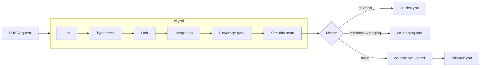

# CI/CD Strategy — GitHub Actions

> **Status:** Draft v1.0 · **Owner:** DevOps · Build → Test → Lint → Scan → Image → ECR → Deploy → Rollback.
> Auth to AWS via **OIDC** (no long-lived keys). Immutable image tags (git SHA).

---

## 1. Pipeline Overview



## 2. CI (`ci.yml`, on PR + push)

1. **Lint** — ESLint + Prettier check.
2. **Typecheck** — `tsc --noEmit` (strict, no `any`).
3. **Unit tests** — Vitest/Jest.
4. **Integration tests** — with ephemeral Mongo service container.
5. **Coverage gate** — fail if < 80% (100% on auth/ownership).
6. **Security scan** —
   - `npm audit --audit-level=high`
   - **Trivy** (filesystem + image)
   - **CodeQL** (SAST) — `codeql.yml`
   - **gitleaks** (secret detection)
7. Upload artifacts (coverage, SARIF to GitHub Security).

Branch protection: these checks **required** before merge; ≥1 review (CODEOWNERS).

## 3. CD — Dev (`cd-dev.yml`, on merge to `develop`)

1. Build multi-stage Docker images (api, frontend).
2. Tag with git SHA; Trivy scan; push to **ECR**.
3. Upload SPA build to S3 + CloudFront invalidation.
4. Deploy API: SSM Run Command (cheap) or `ecs update-service` (prod-style).
5. **Smoke test:** poll `/ready`; run a tiny Playwright happy-path.
6. Notify (SNS/Slack) on success/failure.

## 4. CD — Staging (`cd-staging.yml`, on `release/*`)

- Same as dev against staging env + full E2E suite + optional load test.
- Manual approval to promote.

## 5. CD — Prod (`cd-prod.yml`, on `main`)

- **Manual approval** (environment protection rule).
- Promote the **same image digest** validated in staging (no rebuild).
- Strategy: blue-green / rolling (ECS) or instance refresh (ASG).
- Post-deploy smoke + health verification; auto-abort on health failure.

## 6. Rollback (`rollback.yml`, manual dispatch)

- Input: previous image tag (SHA).
- Redeploy that immutable tag; invalidate CloudFront for SPA.
- DB migrations are **expand/contract** (backward compatible) so app rollback is safe without DB rollback.
- Verify `/ready` + smoke; record incident note.

## 7. Secrets in CI

- **No static AWS keys** — GitHub OIDC assumes a scoped IAM role.
- App secrets come from **Secrets Manager at runtime**, never injected into images.
- gitleaks blocks accidental secret commits.

## 8. Caching & Speed

- Cache npm/pnpm store and Docker layers (buildx + registry cache).
- Run jobs in parallel (lint/typecheck/test matrix) where independent.

## 9. Environments & Promotion Model

```
feature/* → PR → develop (dev)  →  release/* (staging)  →  main (prod)
                     auto              approval               approval
```

Config differs per env (env vars + secrets); **artifact is identical**.

## 10. Review Gates (Documentation-First cadence)

Every phase PR must include: updated docs/CLAUDE.md, ADR if needed, passing Architecture Review and Security Review output (`.claude/output-styles`).
