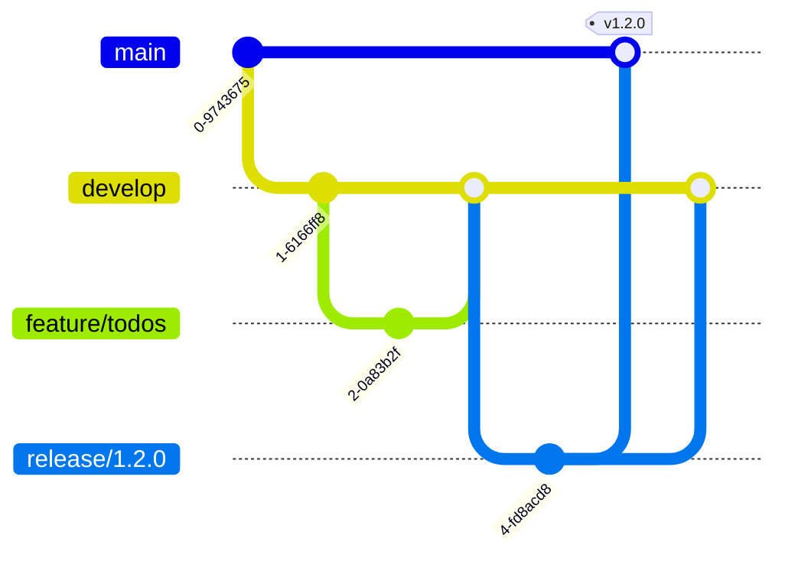

# Git Branching Strategy

> **Status:** Draft v1.0 · **Owner:** Eng Lead · GitFlow-lite mapped to environments.
> Trunk-ish with protected long-lived env branches. Conventional Commits + signed commits.

---

## 1. Branches

| Branch      | Purpose                           | Deploys to             | Protected |
| ----------- | --------------------------------- | ---------------------- | --------- |
| `main`      | production-ready, tagged releases | **Production** (gated) | ✅        |
| `staging`   | release candidate validation      | **Staging**            | ✅        |
| `qa`        | QA verification                   | **QA**                 | ✅        |
| `develop`   | integration of features           | **Development**        | ✅        |
| `feature/*` | new work                          | — (CI only)            | —         |
| `release/*` | stabilize a release               | Staging                | ✅        |
| `hotfix/*`  | urgent prod fix                   | Prod (fast path)       | —         |

## 2. Flow



1. **Feature:** branch from `develop` → `feature/<scope>-<desc>`. PR back to `develop`. CI required.
2. **QA/Staging promotion:** `develop` → `qa` → `staging` (or via `release/*`) as it stabilizes.
3. **Release:** cut `release/x.y.z` from `develop`; only fixes; merge to `main` (tag `vX.Y.Z`) **and** back-merge to `develop`.
4. **Hotfix:** branch from `main` → `hotfix/<issue>`; merge to `main` (deploy) **and** back-merge to `develop`/`release`. See `hotfix-process.md`.

## 3. Commit Convention

- **Conventional Commits:** `feat:`, `fix:`, `chore:`, `docs:`, `refactor:`, `test:`, `ci:`, `perf:`, `sec:`.
- Enforced via commitlint (Husky). Drives changelog + semver.
- Signed commits (GPG/SSH) where possible.

## 4. PR Rules

- Small, focused PRs. Linked issue. Filled `pull_request_template.md`.
- Required: green CI, ≥1 approval (CODEOWNERS), updated docs/tests, no unresolved review comments.
- No direct pushes to protected branches.
- Squash-merge feature→develop (clean history); merge-commit for release/hotfix (traceability).

## 5. Versioning & Tags

- **SemVer** `MAJOR.MINOR.PATCH`. Tags on `main`. Image tag = git SHA; release tag annotates the SHA.

## 6. Environment ↔ Branch Mapping

```
develop  → Development
qa       → QA
staging  → Staging
main     → Production
```

Local is per-developer (Docker Compose).
